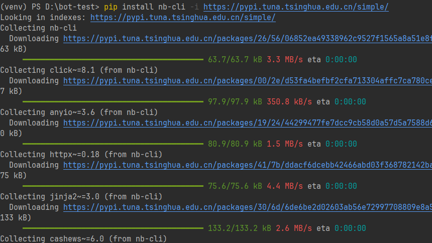
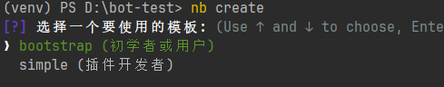
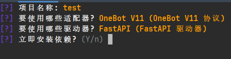
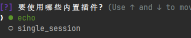
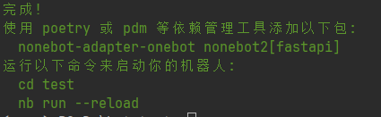
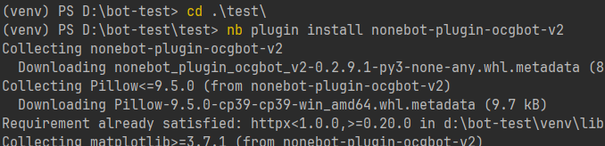
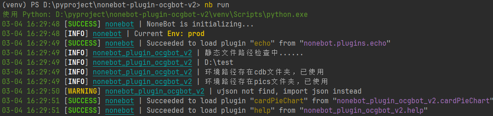

本文档适用于有一定基础的人群搭建小蓝bot。无基础或弱基础人群也可以参考，但可能需要一定的时间理解和做出一定思考。

需要注意的是，ocg-bot-v2从原本的完整机器人优化为了插件形式，具体使用可能需要考虑主体框架变动，本文档仅基于nonebot 2.0.0以及cqhttp 1.1.0版本进行操作

## 1.Python安装
前往 https://www.python.org/ 下载python，并添加进环境变量 Windows系统下载专供Windows的python，如果是linux系统选择下载Linux用python，并按照Linux的方法配置环境变量。

请使用 python 3.9左右版本，太高或太低都有可能造成依赖不兼容问题 

具体python安装方法可以参考网络资料，这里不多加赘述，主要是python版本的选择和软链(环境变量)配置

## 2.机器人搭建以及插件安装
新建文件夹（这个大家总归会知道的吧），任务管理栏使用cmd，使用cd指令进入新建的文件夹（这里也不多说了），在该文件夹下 使用 ```pip install nb-cli``` 指令安装nonebot脚手架
> 注意：如果安装速度过慢，可以在末尾添加``` -i https://pypi.tuna.tsinghua.edu.cn/simple/```
>
> 
>
> 之后所有 pip install 指令都可以添加
>
> 安装完脚手架，我们就可以搭建nonebot空壳，我们使用```nb create``` 指令来创建新机器人，我们需要勾选（空格选择，回车确定）onebot v11、 fastapi、echo
>
> 
>
> 
>
> 

这样，我们的机器人就创建成功了。

接下来我们需要安装ocg-bot-v2插件来实现小蓝的功能哟~

我们需要找到上一步创建的机器人的pyproject.toml文件存放的文件夹位置，并cd到该位置：



> 这里框架给予了我们两条指令，第一条是进入你创建的机器人文件夹的指令，第二条是运行机器人的指令，这里我们先使用第一条。

我们在此位置下使用安装指令（二选一）：

#### 使用 nb-cli 安装
在 nonebot2 项目的根目录下打开命令行, 输入以下指令即可安装
```shell
nb plugin install nonebot-plugin-ocgbot-v2
```

#### 使用pip安装
使用下方指令安装完成之后，需要在pyproject.toml文件的plugins内，添加"nonebot_plugin_ocgbot_v2"
```shell
pip install nonebot-plugin-ocgbot-v2
```

具体如下（注意文件夹名不同）：



之后，我们就可以使用 nb run指令，运行机器人啦!



当然这里还有一些可能需要的配置，具体查看小蓝的github

## 3.账号登录与连接
在上面的步骤中，我们成功装配了机器人框架，但实际上，想要实现一个完整机器人，我们自然需要登录账号，让账号“变成”机器人号。因此我们需要下载 cqhttp进行账号登录。

前往 https://github.com/Mrs4s/go-cqhttp > Releases，下载CQ-HTTP的对应操作系统的执行文件。

使用cd指令进入所下载的文件存放路径(已解压) Linux输入./cqhttp运行文件

Windows直接运行文件

cq在初次运行时会询问代理方式，我们使用```3.反向websocket代理``` 来实现qq机器人。之后在生成的config.yml中设置自己的qq号与密码来完成cq的部署。

此时我们需要修改反向代理的地址：

修改同目录下生成的config.yml文件,修改：
```yml
- ws-reverse:
      # 反向WS Universal 地址
      # 注意 修改这里
      universal: ws://127.0.0.1:8080/onebot/v11/ws
      # 反向WS API 地址
      api: ws://your_websocket_api.server
      # 反向WS Event 地址
      event: ws://your_websocket_event.server
      # 重连间隔 单位毫秒
      reconnect-interval: 3000
      middlewares:
        <<: *default # 引用默认中间件
```
重新运行,之后我们的bot上会显示连接成功的讯息，这就代表机器人部署成功了！

如果我们账号登录出现了 45 错误，那我们就可能需要配置sign服务器，我们可以在config.yml的sign下添加签名服务的地址，之后就可以实现登录。
>1.签名服务器搭建可以参考cqhttp下载地址下的教程信息，或者在同一目录下可能存在大佬公开的签名服务器地址，可以拿来直接使用。
>
>2.在本次搭建中，我们使用了默认服务端口8080，而实际上我们可以通过改变config.yml的代理端口以及在 .env文件下添加 port=xxx，来改变端口。

## Q&A
#### Q1:机器人搭建完后没有卡图怎么办？

**A:** 在github项目文档中，我们说明了可以在.env文件下添加 STATIC_PATH="路径"来指定动态文件路径。

比如我们在D盘创建了一个叫static的文件夹，我们可以添加STATIC_PATH="D:\static"即可指定静态文件，而为了使用卡图，我们需要在这个文件夹内添加新的文件夹pics，并把所有卡图(图片)文件（ygo游戏的同名文件夹）添加进去，这样我就能用卡图了。

当然，小蓝也添加了默认路径--依赖本地路径，如果你能找到nonebot-plugin-ocgbot-v2这个依赖的本地路径，也可以直接同理添加进去，pics可以包含ygo正式版和先行版卡图

整个static文件夹内可以添加多个静态文件数据，具体也请查看github项目文档

 

#### Q2:怎么更新卡表(卡片数据库)？

**A:** 同Q1,不过在static下创建了cdb文件夹，并将ygo游戏的.cdb文件放入其中（先行卡也可以，不要改名）。


#### Q3:我机器人搭建成功，账号也连接上了机器人，为什么输入指令没用？

**A:** nonebot框架默认指令前缀为/,也就是说，所有指令默认需要加上/才会有反应，需要修改请查询官网。

