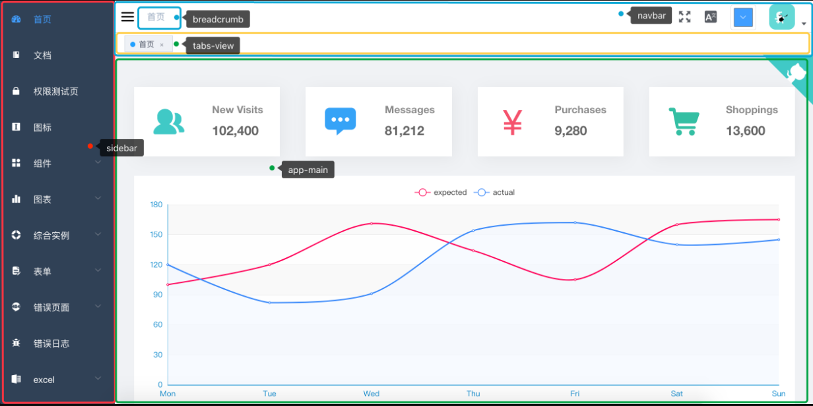
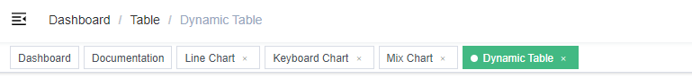

# Vue-admin深入理解报告

## 布局解析

vue-admin布局主要依赖三大块，Layout、app-main、router-view

#### Layout



`vue-element-admin` 中大部分页面都是基于这个 `layout` 的，除了个别页面如：`login` , `404`, `401` 等页面没有使用该`layout`。如果你想在一个项目中有多种不同的`layout`也是很方便的，只要在一级路由那里选择不同的`layout`组件就行。

```js
// No layout
{
  path: '/401',
  component: () => import('errorPage/401')
}

// Has layout
{
  path: '/documentation',

  // 你可以选择不同的layout组件
  component: Layout,

  // 这里开始对应的路由都会显示在app-main中 如上图所示
  children: [{
    path: 'index',
    component: () => import('documentation/index'),
    name: 'documentation'
  }]
}
```

####  app-main

位置于`/layout/components/AppMain`

这里在 `app-main` 外部包了一层 `keep-alive` 主要是为了缓存 `<router-view>` 的，配合页面的 `tabs-view` 标签导航使用

其中`transition` 定义了页面之间切换动画，可以根据自己的需求，自行修改转场动画。相关[文档](https://cn.vuejs.org/v2/guide/transitions.html)。默认提供了`fade`和`fade-transform`两个转场动画，具体 css 实现见`transition.scss`。如果需要调整可在`AppMain.vue`中调整`transition` 的 `name`。

#### router-view

不同的路由使用统一个component在业务中十分常见，默认情况下，我们切换两个页面并不能触发页面内相同组件的created 或者 mounted 钩子，但我们可以在`router-view` 上加上一个唯一的 key，来保证路由切换时都会重新渲染触发钩子了。

## 页面创建和路由和各项参数理解

* 新增页面方式为在`@/router/index.js`下添加新的路由：

  ```html
  {
  	path: '/excel',// 路径，这里为一级路由
    	component: Layout, // 引入的具体view，因为是一级路由，因此为统一的Layout
    	redirect: '/excel/export-excel',// 路由重定向，即输入一级路由后这里为"excel"后重定向地址,也涉及到面包屑最上级跳转，其余参数参考下文
    	name: 'excel',// 名称目前看来无影响
    	// meta主要影响导航栏内名称和图标，以及面包屑名称
  	meta: {
      	title: 'excel',
      	icon: 'excel'
    	}
  	// 这里就是实际的页面路由了，会显示在左侧导航栏，内部和一级路由类似，添加三级路由需要额外设置，具体看下文
  	children: [
          {
            path: 'export-excel',
            component: ()=>import('excel/exportExcel'),
            name: 'exportExcel',
            meta: { title: 'exportExcel' }
          }
       ]
  }
  ```

  > 其中需要注意,如果children下的路由数为1则不会显示下拉框反之则会显示

* 除了上诉提到的路由的各项参数,还存在其他参数可供选择:

  ```javascript
  // 当设置 true 的时候该路由不会在侧边栏出现 如401，login等页面，或者如一些编辑页面/edit/1
  hidden: true // (默认 false)
  
  //当设置 noRedirect 的时候该路由在面包屑导航中不可被点击
  redirect: 'noRedirect'
  
  // 当你一个路由下面的 children 声明的路由大于1个时，自动会变成嵌套的模式--如组件页面
  // 只有一个时，会将那个子路由当做根路由显示在侧边栏--如引导页面
  // 若你想不管路由下面的 children 声明的个数都显示你的根路由
  // 你可以设置 alwaysShow: true，这样它就会忽略之前定义的规则，一直显示根路由
  alwaysShow: true
  
  name: 'router-name' // 设定路由的名字，一定要填写不然使用<keep-alive>时会出现各种问题
  path: 'https://github.com/PanJiaChen/vue-element-admin' // 导航到外链
  meta: {
    roles: ['admin', 'editor'] // 设置该路由进入的权限，支持多个权限叠加
    title: 'title' // 设置该路由在侧边栏和面包屑中展示的名字
    icon: 'svg-name' // 设置该路由的图标，支持 svg-class，也支持 el-icon-x element-ui 的 icon
    noCache: true // 如果设置为true，则不会被 <keep-alive> 缓存(默认 false)
    breadcrumb: false //  如果设置为false，则不会在breadcrumb面包屑中显示(默认 true)
    affix: true // 如果设置为true，它则会固定在tags-view中(默认 false)
  
    // 当路由设置了该属性，则会高亮相对应的侧边栏。
    // 这在某些场景非常有用，比如：一个文章的列表页路由为：/article/list
    // 点击文章进入文章详情页，这时候路由为/article/1，但你想在侧边栏高亮文章列表的路由，就可以进行如下设置
    activeMenu: '/article/list'
  }
  ```

  > 其中activeMenu意思是路由到该路径下后，在导航栏高亮指定的路由地址

* 创建多级路由（如三级路由），需要在上一级的根文件下添加一个`<router-view>`

  ```html
   <!-- 父级路由组件  -->
  <template>
    <div>
      <!-- xxx html 内容  -->
      <router-view />
    </div>
  </template>
  ```

#### 路由

路由分为两种：

1. **constantRoutes：** 代表那些不需要动态判断权限的路由，如登录页、404、等通用页面。
2. **asyncRoutes：** 代表那些需求动态判断权限并通过 `addRoutes` 动态添加的页面。

#### 侧边导航栏默认展开

可以通过`default-openeds`来进行设置，首先找到侧边栏代码`vue-element-admin/src/layout/components/Sidebar/index.vue`

**注意 :default-openeds="['/example','/nested']" 里面填写的是 submenu 的 route-path**

#### 新增页面注意项

* 在新增页面中，我们需要注意几个文件全局和私有设置

  1. view：创建完路由后，我们需要在`views`下创建新的view，并在其文件夹下创建由该view私有的`utils`和`components`，同时公有components存放在全局`components`文件夹下

  2. api：在`apis`下创建对应的接口文件夹，用于维护接口

  3. 样式：在引入css的时候，考虑到全局css，每一个页面的样式就写在当前 `views`下面，请记住加上`scoped` 或者命名空间，避免造成全局的样式污染。

     ```html
     <style>
     /* global styles */
     </style>
     
     <style scoped>
     /* local styles */
     .xxx-container{
       /* name scoped */
       xxx
     }
     </style>
     
     ```

     > scoped 表示该css私有，只会作用于此组件以及其子组件下

## 样式

样式上存在两个问题：

1. **全局污染 —— CSS 文件中的选择器是全局生效的，不同文件中的同名选择器，根据 build 后生成文件中的先后顺序，后面的样式会将前面的覆盖；**

2. 选择器复杂 —— 为了避免上面的问题，我们在编写样式的时候不得不小心翼翼，类名里会带上限制范围的标示，变得越来越长，多人开发时还很容易导致命名风格混乱，一个元素上使用的选择器个数也可能越来越多，最终导致难以维护。

因此vue提供了scoped解决这个问题，它给css加了一个域的概念，只要加上 `<style scoped>` 这样 css 就只会作用在当前组件内了。

> 使用 scoped 后，父组件的样式将不会渗透到子组件中。不过一个子组件的根节点会同时受其父组件的 scoped CSS 和子组件的 scoped CSS 的影响。这样设计是为了让父组件可以从布局的角度出发，调整其子组件根元素的样式。

####  自定义 element-ui 样式

现在我们来说说怎么覆盖 element-ui 样式。由于 element-ui 的样式我们是在全局引入的，所以你想在某个页面里面覆盖它的样式就不能加 scoped，但你又想只覆盖这个页面的 element 样式，你就可在它的父级加一个 class，用命名空间来解决问题。

```css
.article-page {
  /* 你的命名空间 */
  .el-tag {
    /* element-ui 元素*/
    margin-right: 0px;
  }
}
```

也可以使用深度作用选择器：

当你子组件使用了 `scoped` 但在父组件又想修改子组件的样式可以 通过 `>>>` 来实现：

```css
<style scoped>
.a >>> .b { /* ... */ }
</style>
```

## 服务器交互

vue-admin的请求流程为：

1. UI进行操作

2. 调用api目录下的请求参数

3. 使用分装的request.js来发送请求

4. 获取服务端返回

`@/utils/request.js` 是基于 [axios](https://github.com/axios/axios) 的封装，便于统一处理 POST，GET 等请求参数，请求头，以及错误提示信息等。具体可以参看 [request.js](https://github.com/PanJiaChen/vue-element-admin/blob/master/src/utils/request.js)。 它封装了全局 `request拦截器`、`response拦截器`、`统一的错误处理`、`统一做了超时处理`、`baseURL设置等`。

#### 设置多个baseURL

首先我们需要明白，vue-admin的请求地址由两部分组成`url = baseURL + requestURL`

`baseURL`一般在request.js内定义，一般为api的根目录（如果不写入完整地址，则会默认使用当前运行地址）

`requestURL`为api接口方法下定义，一般为具体的api的具体地址

我们可以通过环境变量设置多个`baseURL`，从而请求不同的 api 地址。

```bash
# .env.development
VUE_APP_BASE_API = '/dev-api' #注入本地 api 的根路径
VUE_APP_BASE_API2 = '/dev-api2' #注入本地 api2 的根路径
```

之后根据环境变量创建`axios`实例，让它具有不同的`baseURL`。

```js
// create an axios instance
const service = axios.create({
  baseURL: process.env.BASE_API, // api 的 base_url
  withCredentials: true, // 在跨域时发送cookie
  timeout: 5000 // request timeout
})

const service2 = axios.create({
  baseURL: process.env.BASE_API2, // api2 的 base_url
  timeout: 5000 // request timeout
})
```

也可以在api方法下直接通过覆盖方式使用

```js
export function fetchList(query) {
  return request({
    url: '/article/list',
    method: 'get',
    params: query,
    baseURL: 'xxxx' // 直接通过覆盖的方式
  })
}
```

## 快捷导航(标签栏导航)

即页面面包屑下方的tag导航栏：



这方面比较复杂，而且用处不大，就不深究了。明白如何移除就行：

首先找到 `@/layout/components/AppMain.vue` 然后移除 `keep-alive`

```html
<template>
  <section class="app-main" style="min-height: 100%">
    <transition name="fade-transform" mode="out-in">
      <router-view></router-view>
    </transition>
  </section>
</template>
```

然后移除整个 `@/layout/components/TagsView.vue` 文件，并在`@/layout/components/index` 和 `@/layout/Layout.vue` 移除相应的依赖。最后把 `@/store/modules/tagsView` 相关的代码删除即可。